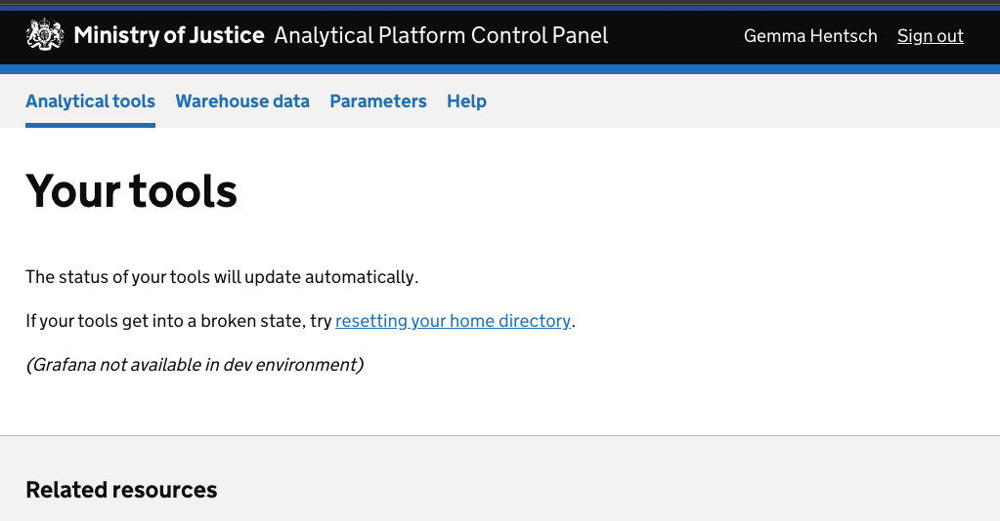
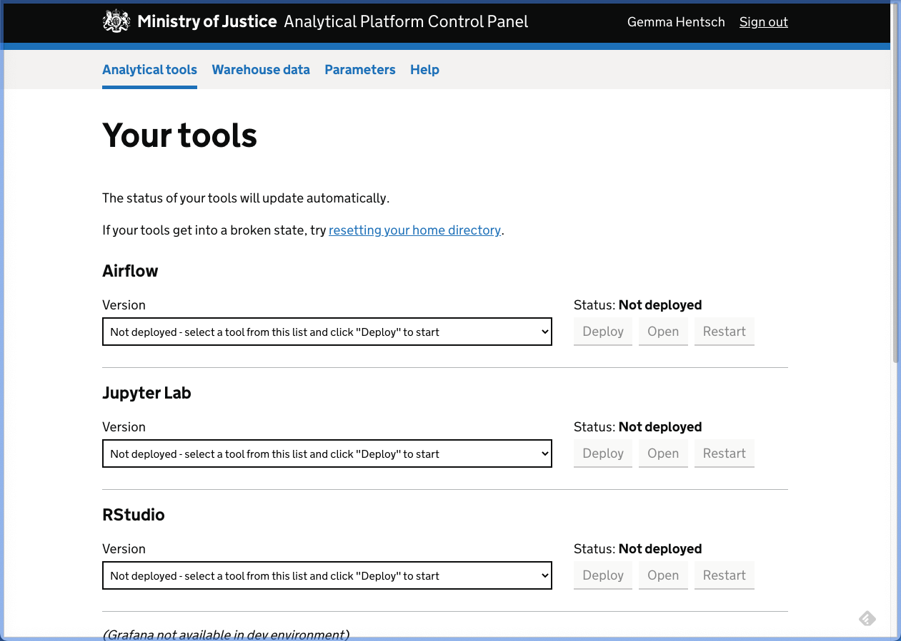

# ANPL-857 removal of dependency on external cluster

The aim was to use a local kind cluster, instead of using dev-kops (or now dev-eks).

## What we wanted to achieve

Currently our "development" process uses the dev cluster in AWS, either the old KOPS cluster, or the new EKS one, this is not ideal, for many reasons.

The task was to achieve the following
- Controlpanel would talk to the kind cluster instead of the remote one
- You could authenticate a new user, and the relevant charts would be run in the kind cluster
- You could successfully deploy a tool in the kind cluster

At this stage, we didn't intend to interact with the tool, so ingress wasn't needed, just that the tool was successfully spun up.

## What we have achieved

- Controlpanel is talking to the kind cluster.
- You can authenicate a user, their namespace is created, but you cannot run the `provision-user` chart.
- You can see the tools to deploy, you can call for a deployment, but the deployment currently fails.

## Pre-getting started setup

Currently this is based on also having [`tools-controller-poc`](https://github.com/jasonBirchall/tools-controller-poc) setup

### Go versions warning
You will currently need to use go 1.17

If you're on a mac, you can install using 
```bash
brew install go@1.17
# You'll need to symlink into your path because its a keg only formula, for example
ln -s /usr/local/opt/go@1.17/bin/go ~/bin/go
```

### Set up the kind cluster
```bash
# checkout in a new directory
git clone https://github.com/jasonBirchall/tools-controller-poc
cd tools-controller-poc/
# This instantiates the cluster
./create-kind.sh 
# Copy config into place for controlpanel to pick up
kind get kubeconfig --internal > ~/.kube/controlpanel
```

## Getting started

We've created a set of make commands that mirror their dev-* counterparts

| make | effect |
| ----------------- | -------------------------------|
|  local-prepare-up |  Run migration before doing up (run automatically) |
|  local-daemon     |  Startup with docker process in background (to stop afterwards use make clean) |
|  local-fg         | Startup with docker process in foreground     |
|  local-attach     | Attach to existing running background controlpanel docker process for purposes of debugging    |
|  local-py         | Start django shell (in the dev-packages context) in new container     |
|  local-run        | Start shell in new copy of controlpanel container  |
|  local-exec       | Exec into shell of existing controlpanel container     |

So to build and run

```bash
# Authenticate with ECR
make docker-login

# Build the containers
make eks

# bring up in foreground
aws-vault exec admin-dev -- make local-fg
```

You should now be able to go to http://localhost:8000/ and login via Auth0

### If it goes wrong on the login
| Error message | What this means |
| ------------- | ----------------|
| 'no oidc credentials' | You've not run aws-vault exec before the make command |
| 'APIException' on the /tools/ page |  You've not copied over the kube config from kind |
| 'MaxRetryError at /tools/' | You've created a new kind cluster and not updated your .kube/controlpanel file |


### Getting to the tools page and nothing is there

Once you've logged in you'll get the follow view



So all the fixture based tool releases are for the KOPS cluster, and you're now using the EKS container/setup which means none of the default tool releases will show up.

So to fix this, log in via local-py.

```bash
# Login to python shell
make local-py
# Import the Tool release model
In [1]: from controlpanel.api.models import Tool
# Update the tools to be EKS
In [2]: Tool.objects.update(target_infrastructure=Tool.EKS)
```



Now reload the page you'll see some shiny tools (you might need to restart the server).

_N.B. these are archaic versions of the tools and should in no way be expected to work, even if deployment was working_

You can click deploy, and it will try and deploy, but unfortunatly you'll get a failed response back, which gets us as far as we've gotten and we can now move on to the "what needs fixing" section.


## What isn't working.

### Account creation

Currently we've disabled the provision user chart, because the chart needs access to S3 and IAM to instantiated the user and give them credentials.

This was done by commenting out lines in [controlpanel/api/cluster.py](https://github.com/ministryofjustice/analytics-platform-control-panel/blob/5a5d0db63c77aea8b8aad419d829f76555a7f4f3/controlpanel/api/cluster.py#L63-L75).


### Doing a deployment

Its not always easy to surface what's gone wrong because the deployment happens on the worker rather than the frontend container, when trying to deploy, you'll get a failure response back.

Here is the error message from my worker when trying to deploy juypterlab
```
{'event': 'Missing value for helm chart param release - jupyter-lab-ladyrassilon version - 0.4.3 namespace - user-ladyrassilon, key name - toolsDomain', 'timestamp': '2022-04-21T13:48:03.769214Z', 'logger': 'controlpanel.api.cluster', 'level': 'warning'}
{'event': 'Release "jupyter-lab-ladyrassilon" does not exist. Installing it now.', 'timestamp': '2022-04-21T13:48:15.906479Z', 'logger': 'controlpanel.api.models.tool', 'level': 'error'}
{'event': 'Error: unable to build kubernetes objects from release manifest: [unable to recognize "": no matches for kind "Deployment" in version "apps/v1beta2", unable to recognize "": no matches for kind "Ingress" in version "extensions/v1beta1"]', 'timestamp': '2022-04-21T13:48:15.907187Z', 'logger': 'controlpanel.api.models.tool', 'level': 'error'}
{'event': 'Failed deploying Jupyter Lab for ladyrassilon', 'timestamp': '2022-04-21T13:48:16.969753Z', 'logger': 'controlpanel.frontend.consumers', 'level': 'warning'}
```

Its not complaining about the release, its the lines after that that need to be looked at. 

```bash
# my current namespaces
❯ kubectl get namespaces
NAME                          STATUS   AGE
default                       Active   179m
kube-node-lease               Active   3h
kube-public                   Active   3h
kube-system                   Active   3h
local-path-storage            Active   179m
user-ladyrassilon             Active   159m
```

The user namespace exists, but other components are missing, including the ingress controller.

We expect that there will need to be a storage backend and a dummy ingress controller that the charts can run against.

### Other areas

Anything that is talking to IAM, S3, Apps, Concourse, or Elastic search should not be expected to work, first two will be dependent on [Localstack ticket](https://dsdmoj.atlassian.net/browse/ANPL-858) work, and others are outside of spec.

## Learnings

### Connecting the cluster to controlpanel

We resolved the networking issues by making the controlpanel containers use the existing kind network. We created the kind network first.

This has been updated both in the dev and main docker-compose files.

To get the config of the kind cluster to be available for the control panel we used the following command, before startup:

```bash
kind get kubeconfig --internal > ~/.kube/controlpanel
```

As part of testing we added in the is_kube_connected api view, for diagnostic purposes, which essentially returns "we've connected, and we've got access to the default namespace", this is only active in debug mode, however we probably should pull this out into a basic view for dev purposes and debugging.

## Cleanup

### Several places

There are some commented out code and config that can be cleaned up.

### docker-compose.dev

The extra-hosts sections can be removed, it was part of an earlier effort to connect the cluster and controlpanel.

On 
- [Frontend](https://github.com/ministryofjustice/analytics-platform-control-panel/blob/5a5d0db63c77aea8b8aad419d829f76555a7f4f3/docker-compose.dev.yaml#L23-L24)
- [Migration](https://github.com/ministryofjustice/analytics-platform-control-panel/blob/5a5d0db63c77aea8b8aad419d829f76555a7f4f3/docker-compose.dev.yaml#L29-L30)
- [Worker](https://github.com/ministryofjustice/analytics-platform-control-panel/blob/5a5d0db63c77aea8b8aad419d829f76555a7f4f3/docker-compose.dev.yaml#L37-L38)

### Dockerfile
As part of our diagnostics and development, we left these lines in the [Dockerfile](https://github.com/ministryofjustice/analytics-platform-control-panel/blob/5a5d0db63c77aea8b8aad419d829f76555a7f4f3/Dockerfile#L56-L65), which will need cleaning up if they're still there. 
```Dockerfile
RUN apt-get update
RUN apt-get install -y curl ca-certificates apt-transport-https gnupg
RUN curl -s https://packages.cloud.google.com/apt/doc/apt-key.gpg | apt-key add -
RUN touch /etc/apt/sources.list.d/kubernetes.list
RUN echo "deb http://apt.kubernetes.io/ kubernetes-xenial main" | tee -a /etc/apt/sources.list.d/kubernetes.list
RUN apt-get update
RUN apt-get install -y kubectl
RUN apt-get install -y awscli
RUN apt-get install -y iputils-ping
RUN apt install iproute2 -y
```

