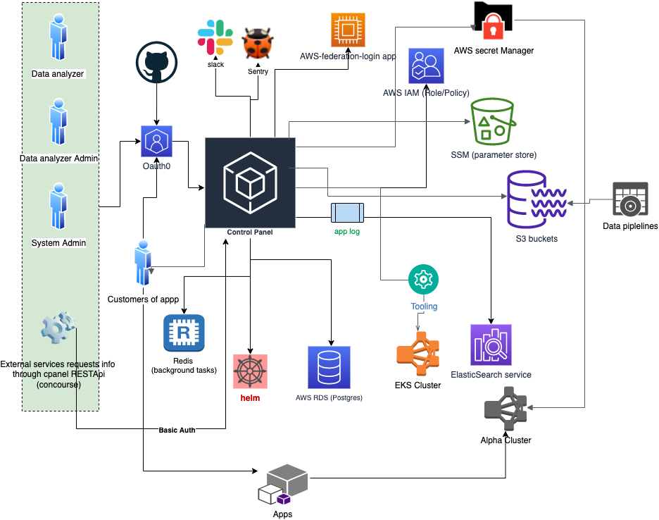

# Architecture

This document shows the key design and implementation of Control Panel, but it does not go down into the deepest level of detail.
Once you have familiarised yourself with the application's architecture using this document, we recommend delving into the code and our [technical documentation site](https://silver-dollop-30c6a355.pages.github.io/documentation/50-systems/control-panel/#control-panel) for further details.

## System overview

The system diagram above shows the many external tools, services and platforms that the Control Panel interacts with.
This partially explains that the complicated aspects of this app do not arise from the users' requirements, but rather the integration with different external systems.

A few points of particular note:
- Users authenticate to the Control Panel via GitHub through Auth0.
- The main infrastructure that the app communicates with is AWS, including IAM, SSM, Secrets Manager, and EKS clusters.
- Each interaction with an external system requires an authentication + authorisation process, especially for AWS. 
Control Panel needs access to several different AWS accounts which are used to manage different resources. This separation improves the security and organisation of our resources.

## Authentication

The authentication between our end users and the apps including Control Panel, tooling 
and AWS console is managed through Auth0 by using GitHub as an external Identity Provider.

Auth0 is a platform which sits between our applications and our sources of users, 
which adds a level of abstraction so the applications are isolated from any changes to and 
idiosyncrasies of each source's implementation.

More detail information can be read from this link
[Auth0 introduction](https://auth0.com/docs/)

The detailed authentication flow for each login from above diagram is available [here](./doc/auth_flows.md)

## Code structure overview
As we can see above system overview diagram, every external system and service that the Control Panel app interacts with needs 
an authentication process. The majority of them use client-credentials (client_id and client_secret) for 
machine to machine authentication. The slightly complicated part is the interactions with AWS 
services and clusters, which is shown in the following diagram. 

