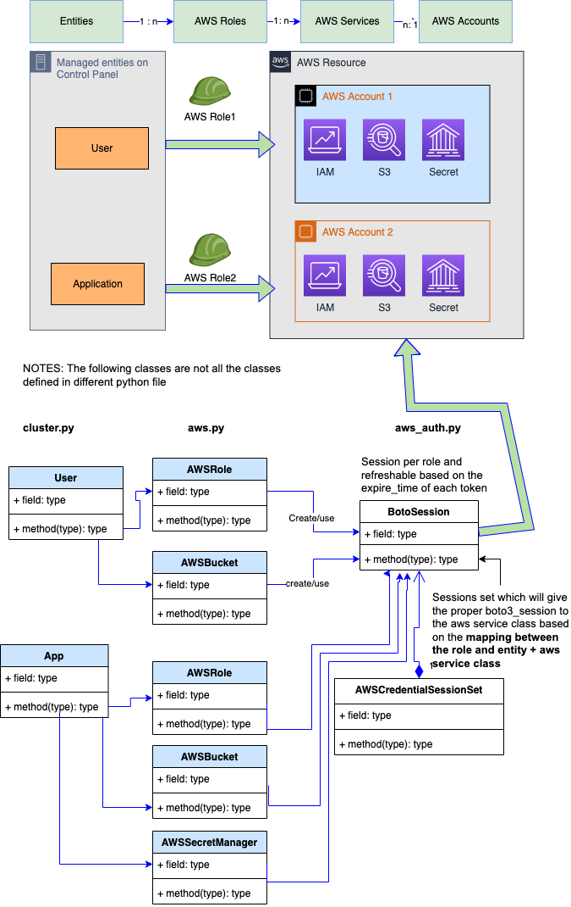

# Architecture

This document shows the key design and implementation of Control Panel, but it does not go down into the deepest level of detail.
Once you have familiarised yourself with the application's architecture using this document, we recommend delving into the code and our [technical documentation site](https://silver-dollop-30c6a355.pages.github.io/documentation/50-systems/control-panel/#control-panel) for further details.

## System overview

The system diagram above shows the many external tools, services and platforms that the Control Panel interacts with.
This partially explains that the complicated aspects of this app do not arise from the users' requirements, but rather the integration with different external systems.

A few points of particular note:
- Users authenticate to the Control Panel via GitHub through Auth0.
- The main infrastructure that the app communicates with is AWS, including IAM, SSM, Secrets Manager, and EKS clusters.
- Each interaction with an external system requires an authentication + authorisation process, especially for AWS. 
Control Panel needs access to several different AWS accounts which are used to manage different resources. This separation improves the security and organisation of our resources.

## Authentication

The authentication between our end users and the apps including Control Panel, tooling 
and AWS console is managed through Auth0 by using GitHub as an external Identity Provider.

Auth0 is a platform which sits between our applications and our sources of users, 
which adds a level of abstraction so the applications are isolated from any changes to and 
idiosyncrasies of each source's implementation.

More detail information can be read from this link
[Auth0 introduction](https://auth0.com/docs/)

The detailed authentication flow for each login from above diagram is available [here](./doc/auth_flows.md)

## Code structure overview
As we can see above system overview diagram, every external system and service that the Control Panel app interacts with needs 
an authentication process. The majority of them use client-credentials (client_id and client_secret) for 
machine to machine authentication. The slightly complicated part is the interactions with AWS 
services and clusters, which is shown in the following diagram. 

In order to support the approach of managing our AWS infrastructure under different AWS accounts, 
our control panel implement the following structure by assuming that we will setup an account to assume
different roles under different accounts (More information about this approach is
[here](https://docs.aws.amazon.com/IAM/latest/UserGuide/tutorial_cross-account-with-roles.html) )

The high level implementation diagram is below 

The mapping between which role the control panel should pick up to create the AWS resource for particular
entity on the app is achieved by using the following convention:
- The entity class + AWS service class typically represents one type of aws resource required by this entity, 
  - Level 1: The most detailed granularity for AWS role can be defined at this level.
  - Level 2: AWS Role on entity level means all those AWS services under this Entity class will share this role
  - Level 3: Default Role for all the entities classes
  - Level 4: Root level, it will create boto session based on the current environment. 
- The actual value of each AWS role will be assumed as environment variable
- The name convention for the environment variable is 
  `Upper case <entity class name>_<AWS service class name>`
  e.g. `USER_AWSROLE_ROLE`, or `APP_AWSBUCKET_ROLE`
  The name for the level 4 is `AWS_DEFAULT_ROLE`
- The logic for the three levels: Will go through the level 1 first , if couldn't find the setting
  from the environment, then go up to level 2, if not find again, then go up to the level 3, 
  so on so forth
  
  
Give an example here if we manage all the AWS resources for User on admin-data account, but manage
app related the resources under admin-dev account, all other entities will be admin-data account too,
then we can set the environment values as below
- `USER_ROLE = "arn:aws:iam::<account id>:role/<role name under admin-data>"`
- `APP_ROLE = "arn:aws:iam::<account id>:role/<role name under admin-dev>"`
- `AWS_DEFAULT_ROLE = "arn:aws:iam::<account id>:role/<role name under admin-data>"`

If there is special case like the secrets of an app is managed in third account, we can define
extra level below
- `APP_AWSSECRETMANAGER_ROLE= "arn:aws:iam::<account id>:role/<role name under third account>`

The current implementation also support to switch different account by profile but it is not pratical 
under cluster environment. 