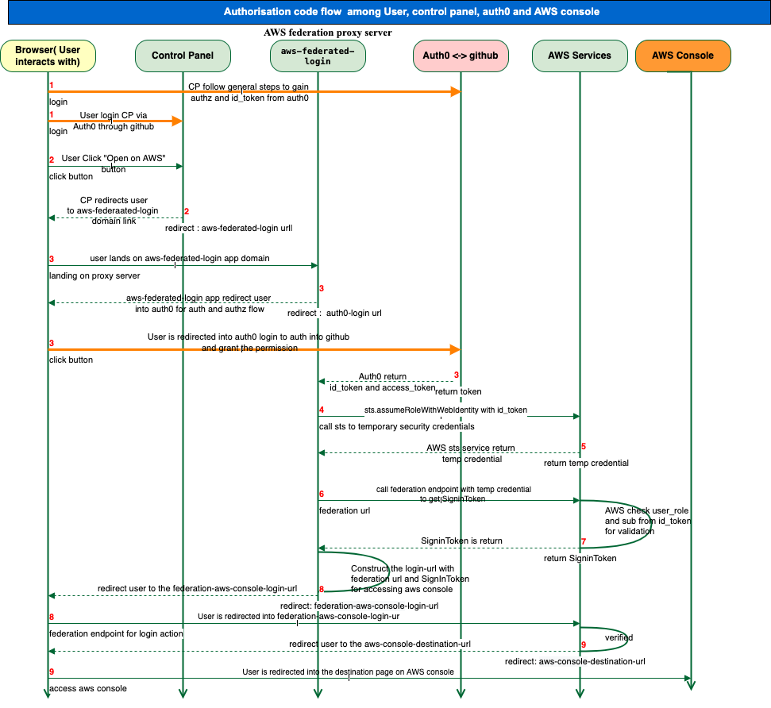

# Authentication flows

Control Panel does not build authentication layer within the app but rather than using Auth0 platform for managing all 
those authentication flows, 3 major ones are listed below
- User logs into Control Panel
- User logs into the tooling environments via Control Panel
- User logs into the AWS console via Control Panel

## Authentication flows for initial token

### 1. User login to Control Panel flow

#### Step 0: Set up 
 - Register Control Panel as an application on Auth0 platform as regular web app
 - Register GitHub as social connection on Auth0 by installing the GitHub extension through the market place
 - Turn on GitHub connection for Control Panel application
 - Setup the proper callback urls 


The variable `CONTROL_PANEL_APP_DOMAIN`, used in the following notes, is the domain name of this app. 
Other settings and environment variables referred in the following steps can be checked from [Control Panel settings and environment variables](./doc/environment.md).

#### Step 1: User initiates login process
The user navigates to Control Panel and starts the process of logging in.

#### Step 2: Make redirect call to Auth0
```shell
https://<OIDC_DOMAIN>/login?
  state=<login_state_value>&
  client=<OIDC_CLIENT_ID>&
  protocol=oauth2&
  response_type=code&
  scope = openid email profile offline-access&
  redirect_uri=https//<CONTROL_PANEL_APP_DOMAIN>/oidc/callback/
  nonce=...
```
#### Step 3: Redirect user to GitHub to grant the authorisation
```shell
https://github.com/login/oauth/authorize?
  response_type=code&
  redirect_uri=https://<OIDC_DOMAIN>/login/callback&
  scope=user:email,read:user,public_repo,repo,read:org&
  state=...&
  client_id=<auth0_github_client_id>
```
If the user hasn't signed in GitHub yet, it will redirect to GitHub's login page
```shell
https://github.com/login?client_id=<auth0_github_client_id>&
  return_to=/login/oauth/authorize?client_id=<auth0_github_client_id>&
  redirect_uri=https://<OIDC_DOMAIN>/login/callback&
  response_type=code&
  scope=user:email,read:user,public_repo,repo,read:org&
  state=...

```
If 2FA has been enabled for GitHub, the user will be asked for a [2FA code](https://github.com/sessions/two-factor) after they have entered their credentials correctly.
Once the 2FA code is provided, they will be returned back to the authorisation page (`/login/oauth/authorize`
indicated by the above `return_to` parameter).

#### Step 4: Redirect back to Auth0
Once the user authorizes the Auth0, the redirect_uri will be called, and the
user will be redirected back to Auth0 to continue the process. 
If 2FA is on, then 
```
https://<OIDC_DOMAIN>/mf?state=<login_state_value>
```
if the code that the user enters is correct, then go to next step

#### Step 5: Invoke callback URL
The original callback url from Control Panel will be called with the authz code from Auth0
```shell
https://<CONTROL_PANEL_APP_DOMAIN>/oidc/callback/?code=<authorization_code>&state=...
```

#### Step 6: Get ID token
Make the call to OIDC_OP_TOKEN_ENDPOINT url to get id_token from Auth0 platform with
the following payload
 ```shell
{
  'client_id': '<OIDC_CLIENT_ID>', 
  'client_secret': '<OIDC_CLIENT_SECRET', 
  'grant_type': 'authorization_code', 
  'code': '<Authz code from auth0>', 
  'redirect_uri': 'http://<CONTROL_PANEL_APP_DOMAIN>/oidc/callback
}
 ```
Auth0 returns back the following result 
```shell
{'access_token': '<access toke in base64>', 
'id_token': '<id token containing the profile of the user (base64 encode)>', 
'scope': 'openid profile email', 
'expires_in': 86400, 
'token_type': 'Bearer'}
```
NOTES: Based on my current understanding, when the call is made to Auth0, Auth0 should make the call
to GitHub as well to get the access_token. Those detail couldn't be justified. 

#### Step 7: Verify the token
The id_token is verified by using nonce + sign_key (from OIDC_OP_JWKS_ENDPOINT).

The example of detailed id_token is below:
```shell
{
  "nickname":"<github username>",
  "name":"<github email> or the name if you setup in your GitHub profile",
  "picture":"https://..",
  "updated_at":"2022-06-26T13:23:29.607Z",
  "email":"<github email>",
  "email_verified":true,
  "iss":"https://<OIDC_DOMAIN>/",
  "sub":"<github auth0_id>",
  "aud":"<cpane auth0_client_id",
  "iat":<Time at which the JWT was issued>,
  "exp":<Expiration time on or after which the ID Token MUST NOT be accepted for processing,
  "acr":"http://schemas.openid.net/pape/policies/2007/06/multi-factor",
  "amr":["mfa"],
  "nonce":"< String value used to associate a Client session with an ID Token, and to mitigate replay attacks>"}

```
https://openid.net/specs/openid-connect-core-1_0.html explains the **Authorization Code Flow**, **the parameters** when making the call and the details of **id_token**.

#### Step 8: Redirect user to the home landing page of Control Panel
The process is now complete.

### 2. User login to tooling flow through Control Panel

The flow is similar as the above except this authentication and authorisation flow takes place between Auth-proxy, Auth0 and GitHub.

### 3. User login to AWS console flow through Control Panel

#### Step 0: Set up
 - Set up Control Panel application as described in first authentication flow
 - Register [AWS Login](https://github.com/ministryofjustice/analytics-platform-aws-federated-login)
   application on Auth0 
 - Turn on GitHub connection for AWS Login application
 - Setup the proper callback urls
 - Create an OpenID Connect (OIDC) identity provider([AWS instruction](https://docs.aws.amazon.com/IAM/latest/UserGuide/id_roles_providers_create_oidc.html))
   with Auth0 client_id of AWS Login application as the value of audience
   


#### Step 1: User logs in
User logs into the Control Panel by following the flow described in [Section 1](#1-user-login-to-control-panel-flow)

#### Step 2: User navigates to AWS via Control Panel
The user clicks the "Open on AWS" button from Control Panel. They will be redirected
into the AWS Login app domain which is 
  - dev: ```https://aws.services.dev.analytical-platform.service.justice.gov.uk/login```
  - prod: ```https://aws.services.analytical-platform.service.justice.gov.uk/login```
  
  with a query parameter, destination:-
  ```s3/buckets/<s3_bucket_name>/?region=eu-west-1&tab=overview#```
    
#### Step 3: Authentication/authorisation via Auth0
AWS login app will redirect the user to Auth0 for authentication and authorisation
by following the same flow in [Section 1](#1-user-login-to-control-panel-flow).

#### Steps 4-5: Get temporary security credentials
AWS login app gets the id_token from previous step, then call AWS STS service below to attain the temporary security credential
```shell
sts.assumeRoleWithWebIdentity({
  RoleArn: arn:aws:iam::<AWS_ACCOUNT_ID>:role/<login_user_AWS_role_name>,
  RoleSessionName: <any name which is sensible to this session, normally username is used>,
  WebIdentityToken: <id_token from auth0>,
})  
```
**NOTE**: A trust relationship for allowing the user's role to perform assumeRoleWithWebIdentity through id_token needs to be added.

A temporary security credential is returned, it contains 3 key information
```shell
{
  "AccessKeyId": <>,
  "SecretAccessKey": <>,
  "SessionToken": <>
}
```

#### Steps 6-7: Get signin token
Request SigninToken through federation endpoint with the following parameters
```shell
temp_credential =  {
  "sessionId": <AccessKeyId>,
  "sessionKey": <SecretAccessKey>,
  "SessionToken": <SessionToken>
}
https://https://signin.aws.amazon.com/federation?
  Action=getSigninToken&
  SessionDuration=<duration>&
  Session=<temp_credential in json format>
```
AWS federation service returns the SignToken after validation.

#### Steps 8-9: Construct and invoke the federation login URL
The URL can be constructed with the following parameters
```shell
https://https://signin.aws.amazon.com/federation?
  Action=login&
  Issuer=<https://AUTH0_DOMAIN/login>&
  Destination="https://console.aws.amazon.com/"&
  SigninToken=<SignToken from previous step>
```
then the user will be redirected into the federation endpoint again for authentication to AWS console

Once the federation endpoint verifies the call, the user will be redirected into
the destination passed from Control Panel on AWS console 

Example code to access the AWS console through OIDC is available [here](https://docs.aws.amazon.com/IAM/latest/UserGuide/id_roles_providers_enable-console-custom-url.html).

## Authentication flows via refresh token

The Control Panel does not implement the authentication flow by using refresh token
