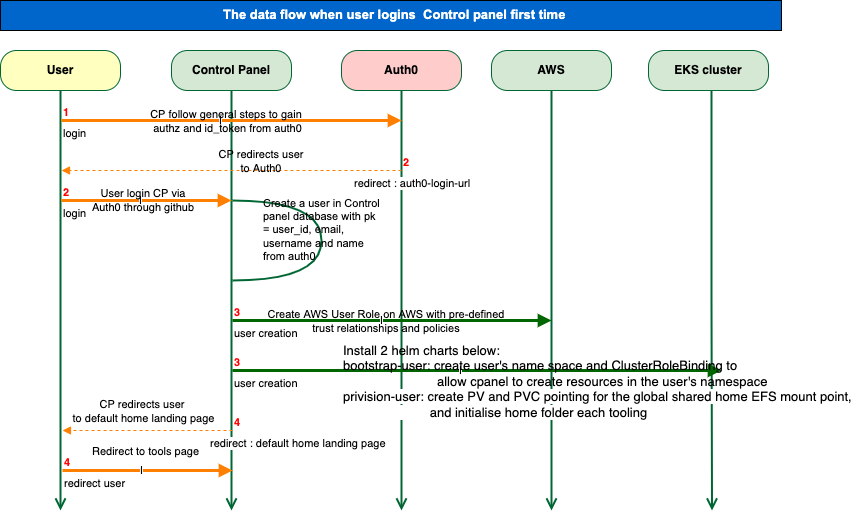
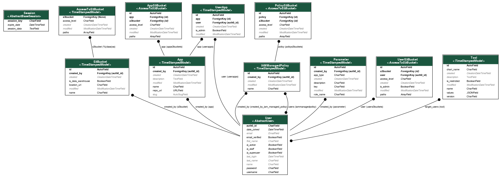

# Data Structure 

This section is to give some overview about the data structure designed in this app.

## Data flows

### The data flow when a user logs into Control Panel for the first time



## Key tables



Generated with 
```bash
./dev-packages/bin/python manage.py graph_models -a -E --exclude-models TestModel,TimeStampedModel,ContentType,AbstractBaseSession,AbstractUser,Group,Permission -o data_structure.png
```

## JSON format

```json
{
  "cli_options": "-a -E --exclude-models TestModel,TimeStampedModel,ContentType,AbstractBaseSession,AbstractUser,Group,Permission -o controlpanel/models.json",
  "created_at": "2021-03-03 18:07",
  "disable_abstract_fields": false,
  "disable_fields": false,
  "graphs": [
    {
      "False": false,
      "None": null,
      "True": true,
      "app_name": "django.contrib.sessions",
      "cluster_app_name": "cluster_django_contrib_sessions",
      "models": [
        {
          "abstracts": [
            "AbstractBaseSession"
          ],
          "app_name": "django_contrib_sessions_models",
          "fields": [
            {
              "abstract": true,
              "blank": false,
              "label": "session_key",
              "name": "session_key",
              "primary_key": true,
              "relation": false,
              "type": "CharField"
            },
            {
              "abstract": true,
              "blank": false,
              "label": "expire_date",
              "name": "expire_date",
              "primary_key": false,
              "relation": false,
              "type": "DateTimeField"
            },
            {
              "abstract": true,
              "blank": false,
              "label": "session_data",
              "name": "session_data",
              "primary_key": false,
              "relation": false,
              "type": "TextField"
            }
          ],
          "label": "Session",
          "name": "Session",
          "relations": []
        }
      ],
      "name": "\"django.contrib.sessions\""
    },
    {
      "False": false,
      "None": null,
      "True": true,
      "app_name": "controlpanel.api",
      "cluster_app_name": "cluster_controlpanel_api",
      "models": [
        {
          "abstracts": [
            "TimeStampedModel"
          ],
          "app_name": "controlpanel_api_models_access_to_s3bucket",
          "fields": [
            {
              "abstract": false,
              "blank": false,
              "label": "s3bucket",
              "name": "s3bucket",
              "primary_key": false,
              "relation": true,
              "type": "ForeignKey (None)"
            },
            {
              "abstract": false,
              "blank": false,
              "label": "access_level",
              "name": "access_level",
              "primary_key": false,
              "relation": false,
              "type": "CharField"
            },
            {
              "abstract": true,
              "blank": true,
              "label": "created",
              "name": "created",
              "primary_key": false,
              "relation": false,
              "type": "CreationDateTimeField"
            },
            {
              "abstract": true,
              "blank": true,
              "label": "modified",
              "name": "modified",
              "primary_key": false,
              "relation": false,
              "type": "ModificationDateTimeField"
            },
            {
              "abstract": false,
              "blank": false,
              "label": "paths",
              "name": "paths",
              "primary_key": false,
              "relation": false,
              "type": "ArrayField"
            }
          ],
          "label": "AccessToS3Bucket",
          "name": "AccessToS3Bucket",
          "relations": [
            {
              "arrows": "[arrowhead=none, arrowtail=dot, dir=both]",
              "label": "s3bucket (%(class)ss)",
              "name": "s3bucket",
              "needs_node": false,
              "target": "S3Bucket",
              "target_app": "controlpanel_api_models_s3bucket",
              "type": "ForeignKey"
            }
          ]
        },
        {
          "abstracts": [
            "TimeStampedModel"
          ],
          "app_name": "controlpanel_api_models_app",
          "fields": [
            {
              "abstract": false,
              "blank": true,
              "label": "id",
              "name": "id",
              "primary_key": true,
              "relation": false,
              "type": "AutoField"
            },
            {
              "abstract": false,
              "blank": false,
              "label": "created_by",
              "name": "created_by",
              "primary_key": false,
              "relation": true,
              "type": "ForeignKey (auth0_id)"
            },
            {
              "abstract": true,
              "blank": true,
              "label": "created",
              "name": "created",
              "primary_key": false,
              "relation": false,
              "type": "CreationDateTimeField"
            },
            {
              "abstract": false,
              "blank": true,
              "label": "description",
              "name": "description",
              "primary_key": false,
              "relation": false,
              "type": "TextField"
            },
            {
              "abstract": true,
              "blank": true,
              "label": "modified",
              "name": "modified",
              "primary_key": false,
              "relation": false,
              "type": "ModificationDateTimeField"
            },
            {
              "abstract": false,
              "blank": false,
              "label": "name",
              "name": "name",
              "primary_key": false,
              "relation": false,
              "type": "CharField"
            },
            {
              "abstract": false,
              "blank": false,
              "label": "repo_url",
              "name": "repo_url",
              "primary_key": false,
              "relation": false,
              "type": "URLField"
            },
            {
              "abstract": false,
              "blank": true,
              "label": "slug",
              "name": "slug",
              "primary_key": false,
              "relation": false,
              "type": "AutoSlugField"
            }
          ],
          "label": "App",
          "name": "App",
          "relations": [
            {
              "arrows": "[arrowhead=none, arrowtail=dot, dir=both]",
              "label": "created_by (app)",
              "name": "created_by",
              "needs_node": false,
              "target": "User",
              "target_app": "controlpanel_api_models_user",
              "type": "ForeignKey"
            }
          ]
        },
        {
          "abstracts": [
            "TimeStampedModel"
          ],
          "app_name": "controlpanel_api_models_iam_managed_policy",
          "fields": [
            {
              "abstract": false,
              "blank": true,
              "label": "id",
              "name": "id",
              "primary_key": true,
              "relation": false,
              "type": "AutoField"
            },
            {
              "abstract": false,
              "blank": false,
              "label": "created_by",
              "name": "created_by",
              "primary_key": false,
              "relation": true,
              "type": "ForeignKey (auth0_id)"
            },
            {
              "abstract": true,
              "blank": true,
              "label": "created",
              "name": "created",
              "primary_key": false,
              "relation": false,
              "type": "CreationDateTimeField"
            },
            {
              "abstract": true,
              "blank": true,
              "label": "modified",
              "name": "modified",
              "primary_key": false,
              "relation": false,
              "type": "ModificationDateTimeField"
            },
            {
              "abstract": false,
              "blank": false,
              "label": "name",
              "name": "name",
              "primary_key": false,
              "relation": false,
              "type": "CharField"
            }
          ],
          "label": "IAMManagedPolicy",
          "name": "IAMManagedPolicy",
          "relations": [
            {
              "arrows": "[arrowhead=none, arrowtail=dot, dir=both]",
              "label": "created_by (created_by_iam_managed_policy)",
              "name": "created_by",
              "needs_node": false,
              "target": "User",
              "target_app": "controlpanel_api_models_user",
              "type": "ForeignKey"
            },
            {
              "arrows": "[arrowhead=dot arrowtail=dot, dir=both]",
              "label": "users (iammanagedpolicy)",
              "name": "users",
              "needs_node": false,
              "target": "User",
              "target_app": "controlpanel_api_models_user",
              "type": "ManyToManyField"
            }
          ]
        },
        {
          "abstracts": [
            "AccessToS3Bucket"
          ],
          "app_name": "controlpanel_api_models_apps3bucket",
          "fields": [
            {
              "abstract": false,
              "blank": true,
              "label": "id",
              "name": "id",
              "primary_key": true,
              "relation": false,
              "type": "AutoField"
            },
            {
              "abstract": false,
              "blank": false,
              "label": "app",
              "name": "app",
              "primary_key": false,
              "relation": true,
              "type": "ForeignKey (id)"
            },
            {
              "abstract": true,
              "blank": false,
              "label": "s3bucket",
              "name": "s3bucket",
              "primary_key": false,
              "relation": true,
              "type": "ForeignKey (id)"
            },
            {
              "abstract": true,
              "blank": false,
              "label": "access_level",
              "name": "access_level",
              "primary_key": false,
              "relation": false,
              "type": "CharField"
            },
            {
              "abstract": true,
              "blank": true,
              "label": "created",
              "name": "created",
              "primary_key": false,
              "relation": false,
              "type": "CreationDateTimeField"
            },
            {
              "abstract": true,
              "blank": true,
              "label": "modified",
              "name": "modified",
              "primary_key": false,
              "relation": false,
              "type": "ModificationDateTimeField"
            },
            {
              "abstract": true,
              "blank": false,
              "label": "paths",
              "name": "paths",
              "primary_key": false,
              "relation": false,
              "type": "ArrayField"
            }
          ],
          "label": "AppS3Bucket",
          "name": "AppS3Bucket",
          "relations": [
            {
              "arrows": "[arrowhead=none, arrowtail=dot, dir=both]",
              "label": "app (apps3buckets)",
              "name": "app",
              "needs_node": false,
              "target": "App",
              "target_app": "controlpanel_api_models_app",
              "type": "ForeignKey"
            }
          ]
        },
        {
          "abstracts": [
            "TimeStampedModel"
          ],
          "app_name": "controlpanel_api_models_parameter",
          "fields": [
            {
              "abstract": false,
              "blank": true,
              "label": "id",
              "name": "id",
              "primary_key": true,
              "relation": false,
              "type": "AutoField"
            },
            {
              "abstract": false,
              "blank": false,
              "label": "created_by",
              "name": "created_by",
              "primary_key": false,
              "relation": true,
              "type": "ForeignKey (auth0_id)"
            },
            {
              "abstract": false,
              "blank": false,
              "label": "app_type",
              "name": "app_type",
              "primary_key": false,
              "relation": false,
              "type": "CharField"
            },
            {
              "abstract": true,
              "blank": true,
              "label": "created",
              "name": "created",
              "primary_key": false,
              "relation": false,
              "type": "CreationDateTimeField"
            },
            {
              "abstract": false,
              "blank": false,
              "label": "description",
              "name": "description",
              "primary_key": false,
              "relation": false,
              "type": "CharField"
            },
            {
              "abstract": false,
              "blank": false,
              "label": "key",
              "name": "key",
              "primary_key": false,
              "relation": false,
              "type": "CharField"
            },
            {
              "abstract": true,
              "blank": true,
              "label": "modified",
              "name": "modified",
              "primary_key": false,
              "relation": false,
              "type": "ModificationDateTimeField"
            },
            {
              "abstract": false,
              "blank": false,
              "label": "role_name",
              "name": "role_name",
              "primary_key": false,
              "relation": false,
              "type": "CharField"
            }
          ],
          "label": "Parameter",
          "name": "Parameter",
          "relations": [
            {
              "arrows": "[arrowhead=none, arrowtail=dot, dir=both]",
              "label": "created_by (parameter)",
              "name": "created_by",
              "needs_node": false,
              "target": "User",
              "target_app": "controlpanel_api_models_user",
              "type": "ForeignKey"
            }
          ]
        },
        {
          "abstracts": [
            "AccessToS3Bucket"
          ],
          "app_name": "controlpanel_api_models_users3bucket",
          "fields": [
            {
              "abstract": false,
              "blank": true,
              "label": "id",
              "name": "id",
              "primary_key": true,
              "relation": false,
              "type": "AutoField"
            },
            {
              "abstract": true,
              "blank": false,
              "label": "s3bucket",
              "name": "s3bucket",
              "primary_key": false,
              "relation": true,
              "type": "ForeignKey (id)"
            },
            {
              "abstract": false,
              "blank": false,
              "label": "user",
              "name": "user",
              "primary_key": false,
              "relation": true,
              "type": "ForeignKey (auth0_id)"
            },
            {
              "abstract": true,
              "blank": false,
              "label": "access_level",
              "name": "access_level",
              "primary_key": false,
              "relation": false,
              "type": "CharField"
            },
            {
              "abstract": true,
              "blank": true,
              "label": "created",
              "name": "created",
              "primary_key": false,
              "relation": false,
              "type": "CreationDateTimeField"
            },
            {
              "abstract": false,
              "blank": false,
              "label": "is_admin",
              "name": "is_admin",
              "primary_key": false,
              "relation": false,
              "type": "BooleanField"
            },
            {
              "abstract": true,
              "blank": true,
              "label": "modified",
              "name": "modified",
              "primary_key": false,
              "relation": false,
              "type": "ModificationDateTimeField"
            },
            {
              "abstract": true,
              "blank": false,
              "label": "paths",
              "name": "paths",
              "primary_key": false,
              "relation": false,
              "type": "ArrayField"
            }
          ],
          "label": "UserS3Bucket",
          "name": "UserS3Bucket",
          "relations": [
            {
              "arrows": "[arrowhead=none, arrowtail=dot, dir=both]",
              "label": "user (users3buckets)",
              "name": "user",
              "needs_node": false,
              "target": "User",
              "target_app": "controlpanel_api_models_user",
              "type": "ForeignKey"
            }
          ]
        },
        {
          "abstracts": [
            "TimeStampedModel"
          ],
          "app_name": "controlpanel_api_models_s3bucket",
          "fields": [
            {
              "abstract": false,
              "blank": true,
              "label": "id",
              "name": "id",
              "primary_key": true,
              "relation": false,
              "type": "AutoField"
            },
            {
              "abstract": false,
              "blank": false,
              "label": "created_by",
              "name": "created_by",
              "primary_key": false,
              "relation": true,
              "type": "ForeignKey (auth0_id)"
            },
            {
              "abstract": true,
              "blank": true,
              "label": "created",
              "name": "created",
              "primary_key": false,
              "relation": false,
              "type": "CreationDateTimeField"
            },
            {
              "abstract": false,
              "blank": false,
              "label": "is_data_warehouse",
              "name": "is_data_warehouse",
              "primary_key": false,
              "relation": false,
              "type": "BooleanField"
            },
            {
              "abstract": false,
              "blank": false,
              "label": "location_url",
              "name": "location_url",
              "primary_key": false,
              "relation": false,
              "type": "CharField"
            },
            {
              "abstract": true,
              "blank": true,
              "label": "modified",
              "name": "modified",
              "primary_key": false,
              "relation": false,
              "type": "ModificationDateTimeField"
            },
            {
              "abstract": false,
              "blank": false,
              "label": "name",
              "name": "name",
              "primary_key": false,
              "relation": false,
              "type": "CharField"
            }
          ],
          "label": "S3Bucket",
          "name": "S3Bucket",
          "relations": [
            {
              "arrows": "[arrowhead=none, arrowtail=dot, dir=both]",
              "label": "created_by (s3bucket)",
              "name": "created_by",
              "needs_node": false,
              "target": "User",
              "target_app": "controlpanel_api_models_user",
              "type": "ForeignKey"
            }
          ]
        },
        {
          "abstracts": [
            "TimeStampedModel"
          ],
          "app_name": "controlpanel_api_models_tool",
          "fields": [
            {
              "abstract": false,
              "blank": true,
              "label": "id",
              "name": "id",
              "primary_key": true,
              "relation": false,
              "type": "AutoField"
            },
            {
              "abstract": false,
              "blank": false,
              "label": "chart_name",
              "name": "chart_name",
              "primary_key": false,
              "relation": false,
              "type": "CharField"
            },
            {
              "abstract": true,
              "blank": true,
              "label": "created",
              "name": "created",
              "primary_key": false,
              "relation": false,
              "type": "CreationDateTimeField"
            },
            {
              "abstract": false,
              "blank": true,
              "label": "description",
              "name": "description",
              "primary_key": false,
              "relation": false,
              "type": "TextField"
            },
            {
              "abstract": false,
              "blank": false,
              "label": "is_restricted",
              "name": "is_restricted",
              "primary_key": false,
              "relation": false,
              "type": "BooleanField"
            },
            {
              "abstract": true,
              "blank": true,
              "label": "modified",
              "name": "modified",
              "primary_key": false,
              "relation": false,
              "type": "ModificationDateTimeField"
            },
            {
              "abstract": false,
              "blank": false,
              "label": "name",
              "name": "name",
              "primary_key": false,
              "relation": false,
              "type": "CharField"
            },
            {
              "abstract": false,
              "blank": false,
              "label": "values",
              "name": "values",
              "primary_key": false,
              "relation": false,
              "type": "JSONField"
            },
            {
              "abstract": false,
              "blank": false,
              "label": "version",
              "name": "version",
              "primary_key": false,
              "relation": false,
              "type": "CharField"
            }
          ],
          "label": "Tool",
          "name": "Tool",
          "relations": [
            {
              "arrows": "[arrowhead=dot arrowtail=dot, dir=both]",
              "label": "target_users (tool)",
              "name": "target_users",
              "needs_node": false,
              "target": "User",
              "target_app": "controlpanel_api_models_user",
              "type": "ManyToManyField"
            }
          ]
        },
        {
          "abstracts": [
            "AbstractUser"
          ],
          "app_name": "controlpanel_api_models_user",
          "fields": [
            {
              "abstract": false,
              "blank": false,
              "label": "auth0_id",
              "name": "auth0_id",
              "primary_key": true,
              "relation": false,
              "type": "CharField"
            },
            {
              "abstract": true,
              "blank": false,
              "label": "date_joined",
              "name": "date_joined",
              "primary_key": false,
              "relation": false,
              "type": "DateTimeField"
            },
            {
              "abstract": true,
              "blank": true,
              "label": "email",
              "name": "email",
              "primary_key": false,
              "relation": false,
              "type": "EmailField"
            },
            {
              "abstract": false,
              "blank": false,
              "label": "email_verified",
              "name": "email_verified",
              "primary_key": false,
              "relation": false,
              "type": "BooleanField"
            },
            {
              "abstract": true,
              "blank": true,
              "label": "first_name",
              "name": "first_name",
              "primary_key": false,
              "relation": false,
              "type": "CharField"
            },
            {
              "abstract": true,
              "blank": false,
              "label": "is_active",
              "name": "is_active",
              "primary_key": false,
              "relation": false,
              "type": "BooleanField"
            },
            {
              "abstract": true,
              "blank": false,
              "label": "is_staff",
              "name": "is_staff",
              "primary_key": false,
              "relation": false,
              "type": "BooleanField"
            },
            {
              "abstract": true,
              "blank": false,
              "label": "is_superuser",
              "name": "is_superuser",
              "primary_key": false,
              "relation": false,
              "type": "BooleanField"
            },
            {
              "abstract": true,
              "blank": true,
              "label": "last_login",
              "name": "last_login",
              "primary_key": false,
              "relation": false,
              "type": "DateTimeField"
            },
            {
              "abstract": true,
              "blank": true,
              "label": "last_name",
              "name": "last_name",
              "primary_key": false,
              "relation": false,
              "type": "CharField"
            },
            {
              "abstract": false,
              "blank": true,
              "label": "name",
              "name": "name",
              "primary_key": false,
              "relation": false,
              "type": "CharField"
            },
            {
              "abstract": true,
              "blank": false,
              "label": "password",
              "name": "password",
              "primary_key": false,
              "relation": false,
              "type": "CharField"
            },
            {
              "abstract": true,
              "blank": false,
              "label": "username",
              "name": "username",
              "primary_key": false,
              "relation": false,
              "type": "CharField"
            }
          ],
          "label": "User",
          "name": "User",
          "relations": []
        },
        {
          "abstracts": [
            "TimeStampedModel"
          ],
          "app_name": "controlpanel_api_models_userapp",
          "fields": [
            {
              "abstract": false,
              "blank": true,
              "label": "id",
              "name": "id",
              "primary_key": true,
              "relation": false,
              "type": "AutoField"
            },
            {
              "abstract": false,
              "blank": false,
              "label": "app",
              "name": "app",
              "primary_key": false,
              "relation": true,
              "type": "ForeignKey (id)"
            },
            {
              "abstract": false,
              "blank": false,
              "label": "user",
              "name": "user",
              "primary_key": false,
              "relation": true,
              "type": "ForeignKey (auth0_id)"
            },
            {
              "abstract": true,
              "blank": true,
              "label": "created",
              "name": "created",
              "primary_key": false,
              "relation": false,
              "type": "CreationDateTimeField"
            },
            {
              "abstract": false,
              "blank": false,
              "label": "is_admin",
              "name": "is_admin",
              "primary_key": false,
              "relation": false,
              "type": "BooleanField"
            },
            {
              "abstract": true,
              "blank": true,
              "label": "modified",
              "name": "modified",
              "primary_key": false,
              "relation": false,
              "type": "ModificationDateTimeField"
            }
          ],
          "label": "UserApp",
          "name": "UserApp",
          "relations": [
            {
              "arrows": "[arrowhead=none, arrowtail=dot, dir=both]",
              "label": "user (userapps)",
              "name": "user",
              "needs_node": false,
              "target": "User",
              "target_app": "controlpanel_api_models_user",
              "type": "ForeignKey"
            },
            {
              "arrows": "[arrowhead=none, arrowtail=dot, dir=both]",
              "label": "app (userapps)",
              "name": "app",
              "needs_node": false,
              "target": "App",
              "target_app": "controlpanel_api_models_app",
              "type": "ForeignKey"
            }
          ]
        },
        {
          "abstracts": [
            "AccessToS3Bucket"
          ],
          "app_name": "controlpanel_api_models_policys3bucket",
          "fields": [
            {
              "abstract": false,
              "blank": true,
              "label": "id",
              "name": "id",
              "primary_key": true,
              "relation": false,
              "type": "AutoField"
            },
            {
              "abstract": false,
              "blank": false,
              "label": "policy",
              "name": "policy",
              "primary_key": false,
              "relation": true,
              "type": "ForeignKey (id)"
            },
            {
              "abstract": true,
              "blank": false,
              "label": "s3bucket",
              "name": "s3bucket",
              "primary_key": false,
              "relation": true,
              "type": "ForeignKey (id)"
            },
            {
              "abstract": true,
              "blank": false,
              "label": "access_level",
              "name": "access_level",
              "primary_key": false,
              "relation": false,
              "type": "CharField"
            },
            {
              "abstract": true,
              "blank": true,
              "label": "created",
              "name": "created",
              "primary_key": false,
              "relation": false,
              "type": "CreationDateTimeField"
            },
            {
              "abstract": true,
              "blank": true,
              "label": "modified",
              "name": "modified",
              "primary_key": false,
              "relation": false,
              "type": "ModificationDateTimeField"
            },
            {
              "abstract": true,
              "blank": false,
              "label": "paths",
              "name": "paths",
              "primary_key": false,
              "relation": false,
              "type": "ArrayField"
            }
          ],
          "label": "PolicyS3Bucket",
          "name": "PolicyS3Bucket",
          "relations": [
            {
              "arrows": "[arrowhead=none, arrowtail=dot, dir=both]",
              "label": "policy (policys3buckets)",
              "name": "policy",
              "needs_node": false,
              "target": "IAMManagedPolicy",
              "target_app": "controlpanel_api_models_iam_managed_policy",
              "type": "ForeignKey"
            }
          ]
        }
      ],
      "name": "\"controlpanel.api\""
    }
  ],
  "use_subgraph": false
}
```
